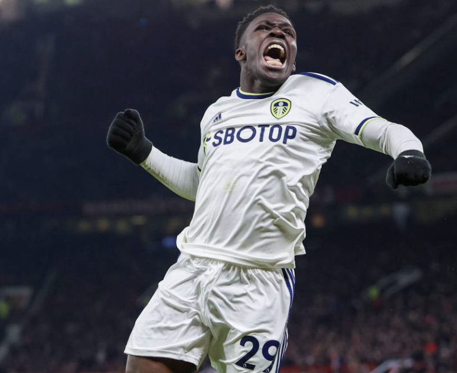

# Wikipedia Edit Assignment – Wilfried Gnonto

## Planned Edits

For this assignment, I will edit the **Wilfried Gnonto** Wikipedia page.  
The two main changes I plan to make are:

1. **Update the infobox image** with a more professional and up-to-date photo.  
2. **Possibly add a new "Style of play" section** describing his pace, dribbling, and versatility.

---

## 1. Updating the Infobox Image

### Current Image

*(This is the current photo of Gnonto on Wikipedia, taken from a youth international match.)*

### Replacement Image

*(This is the image I plan to replace it with, showing Gnonto playing for Leeds United. When making the edit, I will upload the replacement image to Wikimedia Commons under the appropriate license.)*

## Style of play
If appropriate, I may add a new section about Gnonto's playing style. This will be short and cited to reliable football sources.

== Style of play ==
Gnonto is known for his pace, close control, and dribbling ability. He is versatile across the forward line, often deployed as a winger but also capable of playing centrally.<ref>Example source: BBC Sport article or Leeds United official profile</ref>
